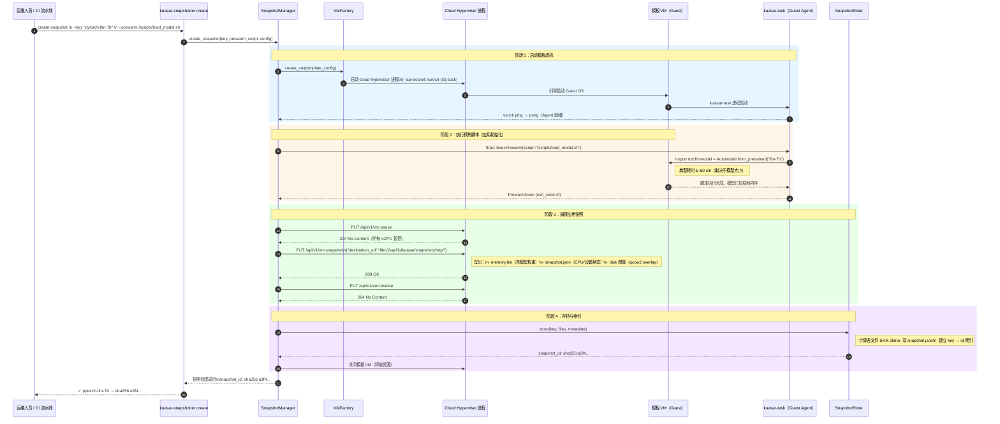

# Application Snapshot and Restore

## 目录 <!-- omit in toc -->

<!-- toc -->
- [概述](#概述)
- [背景与动机](#背景与动机)
  - [Serverless 场景的启动延迟挑战](#serverless-场景的启动延迟挑战)
  - [传统安全容器的启动开销分析](#传统安全容器的启动开销分析)
  - [应用快照 vs. 虚机快照：核心区别](#应用快照-vs-虚机快照核心区别)
  - [目标](#目标)
  - [非目标](#非目标)
- [术语说明](#术语说明)
- [方案概述](#方案概述)
  - [用户故事](#用户故事)
    - [故事一：Python ML 推理沙箱](#故事一python-ml-推理沙箱)
    - [故事二：FaaS 函数平台](#故事二faas-函数平台)
    - [故事三：AI Agent 工具执行环境](#故事三ai-agent-工具执行环境)
  - [风险与缓解措施](#风险与缓解措施)
- [详细设计](#详细设计)
  - [整体架构](#整体架构)
  - [快照创建全流程时序图](#快照创建全流程时序图)
  - [快照恢复全流程时序图](#快照恢复全流程时序图)
  - [核心组件设计](#核心组件设计)
    - [SnapshotManager（快照管理器）](#snapshotmanager快照管理器)
    - [SnapshotStore（快照存储）](#snapshotstore快照存储)
    - [VMRestorer（虚机恢复器）](#vmrestorer虚机恢复器)
    - [WarmPool（预热池）](#warmpool预热池)
    - [NetworkReprogrammer（网络重配置器）](#networkreprogrammer网络重配置器)
    - [PostRestoreInitializer（恢复后初始化器）](#postrestoreinitializer恢复后初始化器)
  - [VMFactory Trait 扩展](#vmfactory-trait-扩展)
  - [Hypervisor 支持](#hypervisor-支持)
    - [Cloud Hypervisor（主要支持）](#cloud-hypervisor主要支持)
    - [StratoVirt](#stratovirt)
    - [QEMU](#qemu)
  - [快照元数据格式](#快照元数据格式)
  - [配置说明](#配置说明)
  - [与传统启动方式的对比](#与传统启动方式的对比)
- [API 设计](#api-设计)
  - [CLI API：kuasar-snapshotter](#cli-apikusasar-snapshotter)
  - [Sandbox 注解 API](#sandbox-注解-api)
  - [ttrpc 扩展：SandboxService 新增方法](#ttrpc-扩展sandboxservice-新增方法)
  - [Rust 公开 API 汇总](#rust-公开-api-汇总)
  - [可观测性 API（Prometheus 指标）](#可观测性-apiprometheus-指标)
  - [错误类型](#错误类型)
- [安全分析](#安全分析)
  - [CVE-2015-2877：KSM 内存侧信道攻击](#cve-2015-2877ksm-内存侧信道攻击)
  - [熵源耗尽（Entropy Starvation）](#熵源耗尽entropy-starvation)
  - [快照文件安全性](#快照文件安全性)
  - [网络标识重用](#网络标识重用)
  - [时钟偏移（Clock Skew）](#时钟偏移clock-skew)
  - [快照内容完整性](#快照内容完整性)
  - [安全措施总览](#安全措施总览)
- [测试计划](#测试计划)
  - [单元测试](#单元测试)
  - [集成测试](#集成测试)
  - [端到端测试](#端到端测试)
- [毕业标准](#毕业标准)
  - [Alpha 阶段](#alpha-阶段)
  - [Beta 阶段](#beta-阶段)
  - [GA 阶段](#ga-阶段)
- [实现历史](#实现历史)
- [方案缺陷](#方案缺陷)
- [替代方案](#替代方案)
  - [纯预热池（无快照）](#纯预热池无快照)
  - [进程级检查点（CRIU）](#进程级检查点criu)
  - [Unikernel](#unikernel)
<!-- /toc -->

---

## 概述

本提案面向 **Serverless 函数计算（FaaS）** 和 **AI Agent 沙箱**等场景，设计一套基于**应用快照（Application Snapshot）**的 Kuasar MicroVM Sandboxer 启动加速方案。

**核心思路**：在虚机内部的**目标应用完成初始化**（运行时环境就绪、依赖库加载完毕、ML 模型载入内存等）之后，对整个 VM 状态进行快照存档。后续创建新沙箱时，直接从该快照**恢复**出一个新实例，跳过全部系统启动和应用初始化阶段，实现从请求到达到应用可用的端到端极致加速。

本方案的加速目标有两层：

1. **系统启动加速**：跳过固件初始化、内核启动、Guest OS 初始化、kuasar-task 启动等固定开销。
2. **应用初始化加速**：跳过运行时库导入、JVM 预热、ML 模型加载等与具体应用相关的初始化开销——这是与纯 VM 快照方案相比的核心增量价值。

---

## 背景与动机

### Serverless 场景的启动延迟挑战

Serverless 计算具有按需调用、弹性伸缩的天然特性。当请求到来时，可能没有任何存活实例；从请求到达到应用代码开始处理的这段时间，是平台的关键 SLA 指标。对于 AI Agent 场景，大语言模型每次工具调用都可能需要创建独立的安全沙箱，若启动延迟达到秒级，将严重影响 Agent 的交互体验。

| 工作负载类型 | 目标端到端延迟 |
|---|---|
| HTTP API 函数 | < 200 ms |
| AI Agent 工具沙箱 | < 500 ms |
| ML 推理沙箱 | < 1 s |
| 批处理任务 | < 5 s |

### 传统安全容器的启动开销分析

以 Kuasar MicroVM Sandboxer + Cloud Hypervisor 为基准，各阶段耗时如下：

```
阶段                              耗时（估算）
──────────────────────────────────────────────────────
固件 / BIOS 初始化                约  50–200 ms
内核启动（含驱动探测）             约 150–400 ms
Guest OS 用户态（systemd 等）     约 100–300 ms
kuasar-task 启动 + 健康检查       约  50–150 ms
── 系统初始化阶段 ──
容器运行时初始化                   约  30– 80 ms
Python：import + 依赖加载         约 500–2000 ms
Python：torch.load(7B 模型)       约   5– 60 s
JVM：类加载 + JIT 预热            约   2– 10 s
Node.js：require() 链             约 200– 800 ms
── 应用初始化阶段 ──
──────────────────────────────────────────────────────
合计（ML 推理场景）                约  6 s – 65 s
合计（普通 FaaS 场景）             约  1 s –  3 s
```

即便使用精简内核和 microVM 机器类型，在没有快照加速的情况下，要实现百毫秒级别的安全沙箱端到端就绪时间极为困难。

### 应用快照 vs. 虚机快照：核心区别

```
纯 VM 快照（OS-level Snapshot）：
  快照时刻 ──► [OS 就绪 + Agent 就绪]
  恢复后仍需 ──► 容器启动 → 应用初始化 → 可用
  节省耗时   ──► 系统初始化阶段（约 300 ms – 1 s）

应用快照（Application Snapshot）：
  快照时刻 ──► [OS 就绪 + Agent 就绪 + 应用已初始化（模型已加载）]
  恢复后直接 ──► 可用（注入调用参数即可）
  节省耗时   ──► 系统初始化 + 应用初始化（约 1 s – 65 s）
```

应用快照要求平台在"应用初始化完成"这一精确时机触发快照，并能在恢复后以轻量级方式注入每次调用的动态参数（输入数据、用户 Token、本次任务描述等）。

### 目标

1. 支持在**应用初始化完成后**对 VM 进行快照（应用快照），实现系统启动与应用初始化耗时的双重跳过。
2. 本期优先支持 **Cloud Hypervisor** ，利用其原生 `vm.snapshot` / `vm.restore` API 实现快照捕获与恢复。
3. 提供**预热池（WarmPool）**机制，维护一批已恢复待命的实例，将沙箱就绪时间进一步压缩至 < 100 ms。
4. 确保恢复后每个实例具有**完整的内存隔离**（CoW 语义）和独立的网络标识，不降低安全边界。
5. 以**可扩展方式**集成到现有 `VMFactory` 抽象，不破坏非快照路径。

### 非目标

- 替代现有启动路径；快照恢复是**可选的加速路径**。
- 运行中沙箱的跨主机热迁移。
- Guest 内部进程级检查点（CRIU 风格）；本方案聚焦于 Hypervisor 级 VM 快照。
- 快照内容的跨主机复制与分发（本期仅支持本地存储）。
- Quark、WASM、runC 等非 MicroVM Sandboxer 的快照支持。

---

## 术语说明

| 术语 | 定义 |
|---|---|
| **应用快照** | 在目标应用初始化完成后，对虚机全状态（CPU 寄存器、内存、设备状态、磁盘增量）的点时捕获。区别于仅在 OS 就绪后捕获的 VM 快照。 |
| **模板虚机** | 用于创建快照的临时 VM：完成 OS 启动 → 执行预热脚本（应用初始化）→ 快照捕获 → 关机。 |
| **快照恢复启动** | 从已有快照恢复出新 VM 实例的启动方式；对应概念为**传统启动**（需完整经历系统和应用所有初始化阶段）。 |
| **传统启动** | 不依赖快照的启动方式，需完整执行系统初始化和应用初始化的全部阶段。 |
| **预热池（WarmPool）** | 已完成快照恢复、处于空闲待命状态的 VM 实例池，可被即时分配给新沙箱请求。 |
| **写时复制（CoW）** | 多个恢复实例共享快照只读内存页；任意实例发生写操作时创建私有副本，立即与其他实例隔离。 |
| **预热脚本** | 在模板虚机中运行的应用初始化代码，用于将应用加载到"可直接服务"状态，之后立即触发快照。 |
| **virtio-rng** | 虚拟化随机数设备，宿主机熵通过此设备向 Guest 传递，是恢复后补充熵的关键通道。 |

---

## 方案概述

**主要流程概览：**

```
【离线阶段：模板快照制备】
  启动模板虚机 → OS/Agent 就绪 → 执行预热脚本（应用初始化）
  → 暂停 vCPU → 触发 vm.snapshot → 存储到 SnapshotStore → 关闭模板虚机

【在线阶段：快照恢复启动】
  沙箱创建请求 → 查询 WarmPool
    ├─ 命中：直接取出预恢复实例
    └─ 未命中：vm.restore 恢复新实例
  → 恢复后初始化（网络重配置 + 熵注入 + 时钟同步）
  → 注入任务参数 → 沙箱就绪
```

### 用户故事

#### 故事一：Python ML 推理沙箱

一个 AI 推理平台需要为每个用户请求提供独立的 Python + PyTorch 沙箱，其中预加载了一个 7B 参数 LLM（加载耗时约 40 秒）。通过应用快照，平台在离线阶段预先完成模型加载并制备快照。每次请求到来时，从快照恢复一个已"持有"该模型的 VM 实例，注入用户的 Prompt 数据，直接开始推理——将沙箱就绪时间从 **40+ 秒**压缩至 **< 300 ms**。

#### 故事二：FaaS 函数平台

一个 Node.js 函数平台在每次传统启动中需要约 1.5 秒完成 VM 启动 + 函数依赖加载（`node_modules`）。借助应用快照，平台为每个函数版本维护一个已完成依赖加载的快照，并在 WarmPool 中预置若干已恢复实例。函数调用到来时，在 **< 50 ms** 内将 WarmPool 实例分配给请求，仅需注入当次调用的事件 Payload。

#### 故事三：AI Agent 工具执行环境

一个 Agent 框架在每次工具调用时都需要启动一个安全的 Python 沙箱执行 LLM 生成的代码。安全要求使用 MicroVM 级隔离，但每次调用均可能触发新沙箱。通过 WarmPool 维护 10–50 个预恢复的 Python 运行时实例，Agent 框架可吸收并发工具调用峰值，同时异步补充池内实例，将用户感知延迟控制在 **< 100 ms**。

### 风险与缓解措施

| 风险 | 严重程度 | 缓解措施 |
|---|:---:|---|
| 快照状态过期（运行时版本、依赖库老化） | 中 | 快照携带版本元数据；平台定期重建快照；TTL 强制执行 |
| 恢复后熵源相同导致密钥碰撞 | 高 | 恢复后强制通过 virtio-rng + vsock 注入新鲜熵（见[安全分析](#安全分析)） |
| KSM 内存侧信道（CVE-2015-2877） | 高 | 禁用宿主机 KSM 或设置 `--memory merge=off`（见[安全分析](#安全分析)） |
| 快照文件泄露敏感数据 | 高 | 文件权限限制；推荐静态加密；禁止将业务密钥嵌入模板 |
| WarmPool 空闲实例占用大量内存 | 中 | 配置 `max_warm` 上限；空闲超时自动回收 |
| 快照文件损坏导致恢复失败 | 中 | SHA-256 完整性校验；失败时自动回退传统启动 |
| 时钟偏移导致 TLS 证书验证失败 | 中 | 恢复后立即通过 vsock 同步时钟 |
| 网络标识冲突 | 高 | 强制在允许流量前完成网络重配置（NetworkReprogrammer） |

---

## 详细设计

### 整体架构

```
┌──────────────────────────────────────────────────────────────────┐
│                      containerd / kubelet                         │
└─────────────────────────┬────────────────────────────────────────┘
                          │  Sandbox API (ttrpc)
┌─────────────────────────▼────────────────────────────────────────┐
│                    KuasarSandboxer (vmm/sandbox)                   │
│                                                                   │
│   ┌───────────────┐       ┌────────────────────┐                 │
│   │   VMFactory   │       │   SnapshotManager   │                 │
│   │  （传统启动）  │       │  （快照恢复启动）   │                 │
│   └───────┬───────┘       └──────────┬─────────┘                 │
│           │                          │                           │
│           │               ┌──────────▼──────────────────┐        │
│           │               │        SnapshotStore          │        │
│           │               │  （内容寻址，本地文件系统）   │        │
│           │               └──────────┬──────────────────┘        │
│           │                          │                           │
│           │               ┌──────────▼──────────┐               │
│           │               │      VMRestorer       │               │
│           │               │  Cloud Hypervisor     │               │
│           │               │  StratoVirt / QEMU    │               │
│           │               └──────────┬──────────┘               │
│           │                          │                           │
│           │               ┌──────────▼──────────┐               │
│           │               │       WarmPool        │               │
│           │               │  （预恢复待命实例池）  │               │
│           │               └──────────┬──────────┘               │
│           │                          │                           │
│   ┌───────▼──────────────────────────▼──────┐                    │
│   │          KuasarSandbox（VM 实例）         │                    │
│   │  ┌──────────────────────────────────┐   │                    │
│   │  │     PostRestoreInitializer        │   │                    │
│   │  │  1. NetworkReprogrammer           │   │                    │
│   │  │  2. EntropyInjector               │   │                    │
│   │  │  3. ClockSynchronizer             │   │                    │
│   │  └──────────────────────────────────┘   │                    │
│   └─────────────────────────────────────────┘                    │
└──────────────────────────────────────────────────────────────────┘
                          │  virtio-vsock / UDS
┌─────────────────────────▼────────────────────────────────────────┐
│             Guest VM（kuasar-task + 应用运行时）                   │
│          应用进程（含已加载的模型、运行时库等）                    │
└──────────────────────────────────────────────────────────────────┘
```

`KuasarSandboxer` 维护两条并行创建路径。当沙箱请求携带 `snapshot_key` 注解且 `SnapshotStore` 中存在匹配快照时，走快照恢复路径；否则走传统启动路径，两条路径完全独立，互不影响。

---

### 快照创建全流程时序图



**关键节点说明：**

- **步骤 7–9（预热脚本）**：在 Guest 内完成模型加载等耗时操作，使快照内存中已持有"热"的应用状态。这是应用快照与纯 VM 快照的核心区别。
- **步骤 10（vm.pause）**：暂停所有 vCPU 后再捕获，保证快照内存的一致性（避免捕获到应用写入中间态）。
- **步骤 11（vm.snapshot）**：Cloud Hypervisor 原生 REST API，将完整 VM 状态（含模型权重所在的堆内存）写出到磁盘。模型权重不再需要在每次沙箱启动时重新加载。

---

### 快照恢复全流程时序图

```mermaid
sequenceDiagram
    autonumber
    participant CD  as containerd
    participant KS  as KuasarSandboxer
    participant SM  as SnapshotManager
    participant WP  as WarmPool
    participant SS  as SnapshotStore
    participant VR  as VMRestorer (CHvRestorer)
    participant CHv as Cloud Hypervisor 进程
    participant VM  as 恢复后 VM（Guest）
    participant GA  as kuasar-task（Guest Agent）
    participant PRI as PostRestoreInitializer

    CD  ->> KS  : CreateSandbox\n(annotations: snapshot_key="pytorch-llm-7b")
    KS  ->> SM  : restore_sandbox("pytorch-llm-7b", network_cfg, sandbox_id)
    SM  ->> SS  : resolve_key("pytorch-llm-7b") → sha256:a3f4...
    SM  ->> WP  : acquire(sha256:a3f4...)

    alt ✅ WarmPool 命中（理想路径，约 40–80 ms 总延迟）
        WP -->> SM : 返回 IdleVM（已恢复待命实例）
        Note over SM,WP: 跳过 vm.restore 步骤\n节省约 50–150 ms
    else ❌ WarmPool 未命中（首次或池耗尽，约 120–250 ms 总延迟）
        SM  ->> SS  : get(sha256:a3f4...) → SnapshotFiles
        SS  ->> SS  : verify_checksums(files)
        SS -->> SM  : memory.bin + snapshot.json + disk.qcow2

        SM  ->> VR  : restore(snapshot_dir, vm_config{prefault=true})
        VR  ->> CHv : 启动 cloud-hypervisor 进程\n--restore source_url=file:///...\n           prefault=true
        Note right of CHv: prefault=true:\n预先映射所有内存页\n（含模型权重）\n避免执行阶段缺页中断
        CHv ->> VM  : 从快照恢复 VM 内存和 CPU 状态
        VM -->> CHv : vCPU 恢复运行，应用进程已就绪
        CHv -->> VR : 恢复成功
        VR -->> SM  : VM 实例（网络标识继承自模板，尚未重配）
    end

    rect rgb(255, 235, 235)
        Note over SM,GA: 恢复后初始化（PostRestoreInitializer）
        SM  ->> PRI : run(vm, sandbox_cfg)

        Note over PRI,GA: 步骤 1：网络重配置（必须在流量允许前完成）
        PRI ->> CHv : PUT /api/v1/vm.remove-device {"id":"net0"}
        PRI ->> CHv : PUT /api/v1/vm.add-net\n{"mac":"52:54:xx:xx","tap":"tap-{id}",...}
        PRI ->> GA  : vsock: reconfigure_network(ip, gw, mask, hostname)
        GA -->> PRI : network OK

        Note over PRI,GA: 步骤 2：熵注入（防止密钥碰撞）
        PRI ->> GA  : vsock: inject_entropy(getrandom_256_bytes)
        GA  ->> VM  : write /dev/urandom; reseed PRNG
        GA -->> PRI : entropy OK

        Note over PRI,GA: 步骤 3：时钟同步（防止 TLS 时间戳异常）
        PRI ->> GA  : vsock: sync_clock(host_unix_nanos)
        GA -->> PRI : clock OK

        PRI -->> SM : 初始化完成
    end

    SM  ->> GA  : vsock ping → pong（最终健康检查）
    SM -->> KS  : Sandbox Ready (sandbox_id)
    KS -->> CD  : CreateSandbox Response

    rect rgb(230, 255, 230)
        Note over CD,GA: 容器启动（标准 Task API 路径，不变）
        CD  ->> KS  : CreateTask(container_spec, env_vars, input_data)
        KS  ->> GA  : ttrpc: CreateTask（通过 vsock）
        GA  ->> VM  : 在应用进程中注入本次调用参数
        VM -->> GA  : 任务进程就绪
        GA -->> KS  : Task Response (pid)
        KS -->> CD  : Task 就绪
    end

    Note over WP: （异步后台）WarmPool 补充:\n触发新的 vm.restore × N 个实例\n补满 min_warm
```

**关键路径耗时说明（Cloud Hypervisor + `prefault=true`，参考硬件：8 核 32 GB）：**

```
操作                                WarmPool 命中    WarmPool 未命中
──────────────────────────────────────────────────────────────────
vm.restore (prefault=true)          —                约 50–150 ms
NetworkReprogrammer (热插拔)        约 20–40 ms      约 20–40 ms
EntropyInjector (vsock)             约  5–10 ms      约  5–10 ms
ClockSynchronizer (vsock)           约  2– 5 ms      约  2– 5 ms
最终健康检查 (ping/pong)            约  1– 3 ms      约  1– 3 ms
容器进程注入 (Task API)             约 10–20 ms      约 10–20 ms
──────────────────────────────────────────────────────────────────
总计                                约 38–78 ms      约 88–228 ms

对比（传统启动 FaaS 场景）          约 1–3 s         约 1–3 s
对比（传统启动 ML 推理场景）        约 6–65 s        约 6–65 s
```

---

### 核心组件设计

#### SnapshotManager（快照管理器）

快照系统的主入口，协调所有子组件。

```rust
pub struct SnapshotManager {
    store:        Arc<SnapshotStore>,
    restorer:     Box<dyn VMRestorer>,
    warm_pool:    Arc<WarmPool>,
    post_restore: Arc<PostRestoreInitializer>,
}

impl SnapshotManager {
    /// 离线：从就绪的模板 VM 制备应用快照
    pub async fn create_snapshot(
        &self,
        vm: &dyn VM,
        prewarm_script: Option<&str>,
        labels: HashMap<String, String>,
    ) -> Result<SnapshotId>;

    /// 在线：从快照恢复一个完整就绪的沙箱
    pub async fn restore_sandbox(
        &self,
        snapshot_key: &str,
        network_config: &NetworkConfig,
        sandbox_id: &str,
    ) -> Result<KuasarSandbox>;

    pub async fn delete_snapshot(&self, id: &SnapshotId) -> Result<()>;
    pub fn list_snapshots(&self) -> Vec<SnapshotMetadata>;
}
```

#### SnapshotStore（快照存储）

内容寻址的本地快照仓库，负责存储、检索和完整性校验。

```rust
pub struct SnapshotStore {
    base_dir: PathBuf,    // 默认：/var/lib/kuasar/snapshots/
    index:    RwLock<HashMap<String, SnapshotId>>,  // key → snapshot_id
}

pub struct SnapshotMetadata {
    pub id:                  SnapshotId,
    pub key:                 String,
    pub labels:              HashMap<String, String>,
    pub hypervisor:          HypervisorType,
    pub hypervisor_version:  String,
    pub created_at:          SystemTime,
    pub vcpus:               u32,
    pub memory_mb:           u64,
    pub prewarm_script_hash: Option<String>,
    pub checksums:           HashMap<String, String>,
}
```

目录结构：

```
/var/lib/kuasar/snapshots/
  index.json                    # key → snapshot_id 索引
  sha256:{id}/
    snapshot.json               # SnapshotMetadata + CHv 原生状态
    memory.bin                  # VM 内存转储（含应用进程堆内存）
    disk.qcow2                  # 磁盘增量（相对于基础镜像的 overlay）
```

#### VMRestorer（虚机恢复器）

各 Hypervisor 实现的共同接口，隐藏各自的快照格式和恢复 API 差异。

```rust
#[async_trait]
pub trait VMRestorer: Send + Sync {
    async fn restore(
        &self,
        snapshot_dir: &Path,
        config: &VmRestoreConfig,
    ) -> Result<Box<dyn VM>>;

    fn hypervisor_type(&self) -> HypervisorType;
}

pub struct VmRestoreConfig {
    pub id:         String,
    pub base_dir:   PathBuf,
    pub netns:      String,
    pub prefault:   bool,   // Cloud Hypervisor: 预先映射所有内存页
    pub mem_shared: bool,   // 是否允许宿主机 KSM（安全场景应设为 false）
}
```

#### WarmPool（预热池）

后台维护预恢复实例，提供近零延迟的沙箱分配。

```rust
pub struct WarmPool {
    pools:    RwLock<HashMap<SnapshotId, VecDeque<IdleVM>>>,
    config:   WarmPoolConfig,
    restorer: Arc<dyn VMRestorer>,
}

pub struct WarmPoolConfig {
    pub min_warm:              usize,
    pub max_warm:              usize,
    pub idle_timeout:          Duration,
    pub replenish_batch_size:  usize,
    pub replenish_concurrency: usize,
}

impl WarmPool {
    /// 原子地取出一个待命实例，并异步触发补充
    pub async fn acquire(&self, snapshot_id: &SnapshotId) -> Option<IdleVM>;
    /// 将未使用实例归还（沙箱创建失败时回退）
    pub async fn release(&self, vm: IdleVM);
    async fn replenish_loop(&self, snapshot_id: SnapshotId);
}
```

#### NetworkReprogrammer（网络重配置器）

恢复后替换 VM 的全部网络标识，防止 MAC/IP 冲突，是安全关键步骤。

```rust
impl NetworkReprogrammer {
    pub async fn reprogram(
        &self,
        vm: &mut dyn VM,
        new_config: &NetworkConfig,
    ) -> Result<()> {
        // 1. 基于 sandbox_id 的 HMAC-SHA256 生成确定性唯一 MAC
        //    （保留 OUI，便于排障时溯源）
        // 2. PUT /api/v1/vm.remove-device {"id": "net0"}  热拔旧设备
        // 3. PUT /api/v1/vm.add-net {mac, tap, ...}       热插新设备
        // 4. vsock: reconfigure_network(ip, gw, mask, hostname)
        // 5. 验证 vsock 连通性（确认 Guest 网络生效）
    }
}
```

#### PostRestoreInitializer（恢复后初始化器）

统一管理恢复后的三个必要安全初始化步骤，**缺少任何一步都可能导致安全问题**。

```rust
pub struct PostRestoreInitializer {
    network: NetworkReprogrammer,
    entropy: EntropyInjector,
    clock:   ClockSynchronizer,
}

impl PostRestoreInitializer {
    pub async fn run(
        &self,
        vm: &mut dyn VM,
        config: &SandboxRestoreConfig,
    ) -> Result<()> {
        // 顺序执行，任一步骤失败则整个沙箱创建失败
        self.network.reprogram(vm, &config.network).await?;
        self.entropy.inject(vm).await?;
        self.clock.sync(vm).await?;
        Ok(())
    }
}
```

---

### VMFactory Trait 扩展

以**向后兼容**方式新增快照相关方法，默认实现返回 `Err`，不影响现有 Hypervisor 实现。

```rust
#[async_trait]
pub trait VMFactory {
    type VM: VM + Sync + Send;
    type Config: Sync + Send;

    fn new(config: Self::Config) -> Self;

    // 现有方法（传统启动路径），保持不变
    async fn create_vm(&self, id: &str, s: &SandboxOption) -> Result<Self::VM>;

    // 新增：应用快照恢复路径（默认返回 Err，不支持快照的 Hypervisor 无需实现）
    async fn restore_vm(
        &self,
        id: &str,
        snapshot_dir: &Path,
        config: &VmRestoreConfig,
    ) -> Result<Self::VM> {
        Err(Error::Unimplemented(
            "app snapshot restore is not supported by this hypervisor".into(),
        ))
    }

    fn supports_app_snapshot(&self) -> bool { false }
}
```

`KuasarSandboxer::create` 检查 `factory.supports_app_snapshot()` 和请求中的 `snapshot_key` 注解，据此路由至对应路径。

---

### Hypervisor 支持

#### Cloud Hypervisor

Cloud Hypervisor 提供一流的原生快照 API，是本方案的首选 Hypervisor。

**快照捕获**（通过 `api.sock` Unix Domain Socket）：

```
# 1. 暂停 vCPU（保证内存一致性）
PUT /api/v1/vm.pause

# 2. 捕获快照
PUT /api/v1/vm.snapshot
Content-Type: application/json
{
  "destination_url": "file:///var/lib/kuasar/snapshots/sha256:a3f4.../"
}

# 3. 恢复 vCPU（可选：捕获后继续运行模板，或直接关机）
PUT /api/v1/vm.resume
```

Cloud Hypervisor 将以下内容写出到目标目录：
- `memory.bin`：完整 Guest 内存转储，包含应用进程的全部堆栈和已加载的模型权重。
- `snapshot.json`：CPU 寄存器状态、设备状态（Cloud Hypervisor 原生格式，不兼容其他 Hypervisor）。
- 磁盘增量通过 qcow2 backing file 机制实现，仅存储相对于基础镜像的变化量。

**快照恢复**：

```
# 启动 cloud-hypervisor 进程时直接指定 --restore 参数
cloud-hypervisor \
  --api-socket /run/ch-{sandbox_id}.sock \
  --restore source_url=file:///var/lib/kuasar/snapshots/sha256:a3f4.../,\
             prefault=true
```

`prefault=true`：恢复时预先将所有快照内存页映射到物理内存（包括模型权重），避免容器执行阶段出现 Major Page Fault。对于大内存工作负载（如 ML 推理），这是强烈推荐的配置，以消除首次推理时的延迟抖动。

**KSM 控制**（安全相关，详见[安全分析](#安全分析)）：

通过 `--memory shared=off,merge=off` 禁止宿主机 KSM 介入 VM 内存，有效缓解 CVE-2015-2877。

#### StratoVirt

StratoVirt 通过 QMP 协议实现快照，其 microVM 机器类型设备状态极简，恢复速度最快，适合对延迟要求最严苛的场景。

- **捕获**：`migrate` 命令 + `exec:` 协议写出内存；`blockdev-snapshot-sync` 写出磁盘增量。
- **恢复**：启动时传入 `--incoming exec:cat snapshot.bin`，或通过 QMP `migrate-incoming` 命令。
- 适用场景：延迟目标 < 100 ms，工作负载不依赖复杂设备（无 PCIe 透传等）。

#### QEMU

QEMU 通过 QMP `migrate` 机制实现快照，兼容性最广，但快照恢复性能略逊于前两者。

- **捕获（外部快照）**：`migrate -d "exec:gzip > memory.bin.gz"` + `blockdev-snapshot-sync`。
- **恢复**：启动时追加 `-incoming "exec:gunzip < memory.bin.gz"` 参数。
- 注意：QEMU 的内部快照（`savevm` 标签）存储在 qcow2 文件内部，**不支持跨进程复用**，不适合多实例恢复场景；应使用外部快照。
- 适用场景：需要兼容特定 QEMU 特性的遗留工作负载；或 Cloud Hypervisor / StratoVirt 不可用的环境。

---

### 快照元数据格式

```json
{
  "version": "1",
  "id": "sha256:a3f4c8b2e91d...",
  "key": "pytorch-llm-7b",
  "created_at": "2026-04-23T08:00:00Z",
  "hypervisor": "cloud-hypervisor",
  "hypervisor_version": "40.0",
  "machine_type": "virt",
  "vcpus": 4,
  "memory_mb": 8192,
  "labels": {
    "runtime": "python3.12",
    "framework": "pytorch-2.3",
    "model": "llm-7b",
    "kuasar.io/snapshot-type": "app-snapshot"
  },
  "prewarm_script_hash": "sha256:9d4e...",
  "files": {
    "memory":   "memory.bin",
    "state":    "snapshot.json",
    "disk":     "disk.qcow2"
  },
  "checksums": {
    "memory":   "sha256:b5c2...",
    "state":    "sha256:f2a3...",
    "disk":     "sha256:d9e1..."
  }
}
```

---

### 配置说明

```toml
# sandboxer.toml — 新增快照相关配置节

[snapshot]
enabled                  = true
store_dir                = "/var/lib/kuasar/snapshots"
max_store_gb             = 100
# 快照校验失败时是否回退传统启动（建议生产环境设为 true）
fallback_on_verify_error = true

[snapshot.warm_pool]
enabled               = true
min_warm              = 2
max_warm              = 20
idle_timeout_secs     = 300
replenish_batch_size  = 3
replenish_concurrency = 4

# 每个快照模板的独立配置
[[snapshot.templates]]
key            = "pytorch-llm-7b"
snapshot_id    = "sha256:a3f4..."
warm_pool_size = 5

[[snapshot.templates]]
key            = "node20-faas"
snapshot_id    = "sha256:b7c9..."
warm_pool_size = 10
```

沙箱请求通过以下注解指定快照模板：

```yaml
annotations:
  snapshotter.kuasar.io/snapshot-key: "pytorch-llm-7b"
```

---

### 与传统启动方式的对比

| 维度 | Docker + runc<br>（传统启动） | Kuasar MicroVM<br>（传统启动） | **Kuasar + 应用快照**<br>（本方案） |
|---|:---:|:---:|:---:|
| 系统初始化延迟 | < 100 ms（无 VM） | 300 ms – 1 s | **跳过（< 5 ms）** |
| 应用初始化延迟（FaaS） | 200–800 ms | 200–800 ms | **跳过** |
| ML 模型加载（7B 参数） | 20–60 s | 20–60 s | **跳过（已在快照中）** |
| FaaS P50 端到端延迟 | 80 ms | 600 ms | **WarmPool: < 80 ms** |
| FaaS P99 端到端延迟 | 300 ms | 2 s | **无 WarmPool: < 300 ms** |
| ML 推理沙箱就绪延迟 | 20–60 s | 20–60 s | **< 300 ms** |
| 隔离级别 | 命名空间（弱） | 硬件 VM（强） | **硬件 VM（强）** |
| 多租户安全性 | 低 | 高 | **高** |
| 每实例空闲内存（CoW 共享后） | ~10 MB | ~256–512 MB | **~64 MB** |
| 每实例增量磁盘 | OverlayFS 层 | 完整镜像 | **qcow2 增量（MB 级）** |

---

## API 设计

本章节描述应用快照功能对外暴露的全部 API 接口，涵盖运维 CLI、containerd 注解、Guest Agent ttrpc 扩展、Rust 内部公开接口以及可观测性指标。

### CLI API：kuasar-snapshotter

新增独立 CLI 工具 `kuasar-snapshotter`，负责快照的离线制备与生命周期管理。所有子命令通过 `--config` 指定 sandboxer 配置文件路径，复用现有 `sandboxer.toml`。

#### 快照制备

```
kuasar-snapshotter create [OPTIONS]

OPTIONS:
  -k, --key <KEY>                   快照的人类可读标识（必填）
  -H, --hypervisor <TYPE>           hypervisor 类型 [cloud-hypervisor|stratovirt|qemu]
                                    默认: cloud-hypervisor
  -c, --config <FILE>               sandboxer 配置文件路径
                                    默认: /etc/kuasar/sandboxer.toml
  -p, --prewarm-script <SCRIPT>     预热脚本路径（应用初始化脚本）
      --prewarm-timeout <DURATION>  预热脚本超时时间 默认: 300s
  -l, --label <KEY=VALUE>           附加标签，可重复指定
  -o, --output <FORMAT>             输出格式 [table|json] 默认: table
      --dry-run                     仅验证配置，不实际创建
      --no-prewarm-verify           跳过预热脚本退出码检查

EXAMPLES:
  # 制备 Python ML 推理运行时快照
  kuasar-snapshotter create \
    --key pytorch-llm-7b \
    --prewarm-script /opt/scripts/load_model.sh \
    --prewarm-timeout 120s \
    --label runtime=python3.12 \
    --label model=llm-7b

  # 制备 Node.js FaaS 运行时快照（无预热脚本，仅系统初始化加速）
  kuasar-snapshotter create --key node20-faas --label runtime=node20
```

#### 快照查询与管理

```
# 列出所有快照
kuasar-snapshotter list [--filter <KEY=VALUE>] [--output <FORMAT>]

# 查看快照详情（含文件 checksum、prewarm 脚本 hash 等）
kuasar-snapshotter inspect <SNAPSHOT_ID_OR_KEY>

# 验证快照文件完整性（重新计算 SHA-256 并比对 snapshot.json）
kuasar-snapshotter verify <SNAPSHOT_ID_OR_KEY>

# 删除快照（同时清理 WarmPool 中该快照对应的所有预恢复实例）
kuasar-snapshotter delete <SNAPSHOT_ID_OR_KEY> [--force]

# 将人类可读 key 更新绑定到新的 snapshot_id（滚动更新场景）
kuasar-snapshotter retag --key <KEY> --snapshot-id <NEW_ID>
```

#### WarmPool 管理

```
# 查看 WarmPool 状态
kuasar-snapshotter warmpool status [--key <KEY>]

OUTPUT（table 格式）:
  KEY               SNAPSHOT_ID     READY   WARMING   MIN   MAX   IDLE_TIMEOUT
  pytorch-llm-7b    sha256:a3f4...   4/5     1         2     10    300s
  node20-faas       sha256:b7c9...   10/10   0         5     20    600s

# 手动触发补充（增加 WarmPool 中的实例数量）
kuasar-snapshotter warmpool replenish --key <KEY> --count <N>

# 清空 WarmPool（维护窗口前使用）
kuasar-snapshotter warmpool drain --key <KEY> [--wait]
```

---

### Sandbox 注解 API

应用层（containerd、kubelet、平台调度器）通过 Sandbox 的 **Labels/Annotations** 选择快照恢复路径和参数，无需修改 Sandbox API 协议本身。

#### 请求注解（创建沙箱时携带）

| 注解键 | 类型 | 默认值 | 说明 |
|---|---|---|---|
| `snapshotter.kuasar.io/snapshot-key` | string | — | 指定快照模板 key；存在此注解时启用快照恢复路径 |
| `snapshotter.kuasar.io/prefault` | bool | `true` | 是否启用 `prefault=true`（预先映射所有内存页） |
| `snapshotter.kuasar.io/fallback` | string | `"cold-start"` | 快照不可用时的回退策略：`cold-start`（传统启动）或 `error`（直接返回错误） |
| `snapshotter.kuasar.io/warmpool-bypass` | bool | `false` | 强制跳过 WarmPool，直接从快照文件恢复（用于测试/调试） |

**示例（Kubernetes Pod 注解）：**

```yaml
apiVersion: v1
kind: Pod
metadata:
  name: ml-inference-job
  annotations:
    snapshotter.kuasar.io/snapshot-key: "pytorch-llm-7b"
    snapshotter.kuasar.io/prefault: "true"
    snapshotter.kuasar.io/fallback: "cold-start"
spec:
  runtimeClassName: kuasar-vmm
  containers:
    - name: inference
      image: inference-runner:latest
```

#### 状态注解（沙箱就绪后由 Sandboxer 回填）

| 注解键 | 说明 |
|---|---|
| `snapshotter.kuasar.io/restore-source` | 实际使用的来源：`warmpool` 或 `snapshot-file` |
| `snapshotter.kuasar.io/snapshot-id` | 实际使用的快照 ID（`sha256:...`） |
| `snapshotter.kuasar.io/restore-duration-ms` | 恢复耗时（ms），含 PostRestoreInitializer |

---

### ttrpc 扩展：SandboxService 新增方法

在现有 `vmm/common/src/protos/sandbox.proto` 的 `SandboxService` 中新增三个 RPC 方法，用于快照恢复后的 Guest Agent 初始化通信。

#### Protobuf 定义

```protobuf
// sandbox.proto — 新增部分（追加到现有 SandboxService）

service SandboxService {
    // --- 现有方法（不变）---
    rpc UpdateInterfaces (UpdateInterfacesRequest) returns (google.protobuf.Empty);
    rpc UpdateRoutes     (UpdateRoutesRequest)     returns (google.protobuf.Empty);
    rpc Check            (CheckRequest)            returns (google.protobuf.Empty);
    rpc ExecVMProcess    (ExecVMProcessRequest)    returns (ExecVMProcessResponse);
    rpc SyncClock        (SyncClockPacket)         returns (SyncClockPacket);
    rpc GetEvents        (google.protobuf.Empty)   returns (containerd.services.events.ttrpc.v1.Envelope);
    rpc SetupSandbox     (SetupSandboxRequest)     returns (google.protobuf.Empty);

    // --- 应用快照新增方法 ---

    // ExecPrewarm：在模板虚机中执行预热脚本，完成应用初始化
    // 仅在快照制备阶段调用，不在恢复路径中调用
    rpc ExecPrewarm (ExecPrewarmRequest) returns (ExecPrewarmResponse);

    // InjectEntropy：向 Guest 内核熵池注入新鲜随机字节
    // 快照恢复后必须调用，防止多实例熵状态相同（见安全分析）
    rpc InjectEntropy (InjectEntropyRequest) returns (google.protobuf.Empty);

    // ReconfigureNetwork：替换 Guest 内的网络标识（IP/路由/主机名）
    // 快照恢复后 NetworkReprogrammer 完成硬件热插拔后，通过此方法通知 Guest 侧更新
    rpc ReconfigureNetwork (ReconfigureNetworkRequest) returns (google.protobuf.Empty);
}

// ──────────────────────────────────────────────
// ExecPrewarm
// ──────────────────────────────────────────────

message ExecPrewarmRequest {
    // 预热脚本在 Guest 内的绝对路径，或内联脚本内容（二选一）
    string script_path   = 1;
    string inline_script = 2;

    // 执行超时（纳秒），0 表示不限制
    int64 timeout_nanos  = 3;

    // 脚本运行的环境变量（追加到 Guest 已有环境）
    map<string, string> envs = 4;
}

message ExecPrewarmResponse {
    // 脚本退出码；非 0 时 SnapshotManager 将中止快照创建
    int32  exit_code = 1;

    // 截断的 stdout/stderr（用于诊断）
    string stdout    = 2;
    string stderr    = 3;

    // 脚本执行耗时（纳秒）
    int64  elapsed_nanos = 4;
}

// ──────────────────────────────────────────────
// InjectEntropy
// ──────────────────────────────────────────────

message InjectEntropyRequest {
    // 由宿主机 getrandom(GRND_RANDOM) 获取的随机字节
    // 推荐长度：256 字节
    bytes entropy_bytes = 1;
}

// ──────────────────────────────────────────────
// ReconfigureNetwork
// ──────────────────────────────────────────────

message ReconfigureNetworkRequest {
    // 新的主机名
    string hostname = 1;

    // 新的网络接口配置（复用现有 Interface / IPAddress / Route 消息类型）
    repeated Interface interfaces = 2;
    repeated Route     routes     = 3;

    // DNS 配置（可选）
    repeated string dns_servers  = 4;
    repeated string dns_searches = 5;
}
```

#### 调用时序与现有方法的关系

```
快照制备阶段（模板虚机中）：
  Check()                ← 等待 Agent 就绪（现有）
  ExecPrewarm()          ← 新增：执行应用初始化脚本

快照恢复阶段（恢复后 PostRestoreInitializer）：
  ReconfigureNetwork()   ← 新增：替换网络标识（在 CHv 热插拔完成后）
  InjectEntropy()        ← 新增：注入新鲜熵
  SyncClock()            ← 复用现有：同步时钟
  Check()                ← 复用现有：最终健康检查
```

---

### Rust 公开 API 汇总

以下是各模块对外暴露的完整公开接口定义，补充"核心组件设计"章节中未覆盖的部分。

#### SnapshotId 类型

```rust
/// 快照的内容寻址标识符，格式为 "sha256:<hex64>"
#[derive(Debug, Clone, PartialEq, Eq, Hash, Serialize, Deserialize)]
pub struct SnapshotId(String);

impl SnapshotId {
    pub fn from_content(files: &[&Path]) -> Result<Self>;  // 计算多文件联合哈希
    pub fn as_str(&self) -> &str;
}

impl std::fmt::Display for SnapshotId {
    // 输出：sha256:a3f4c8b2...
}
```

#### SnapshotStore 完整 API

```rust
impl SnapshotStore {
    pub fn new(base_dir: impl Into<PathBuf>) -> Self;

    /// 存储新快照，返回内容寻址 ID
    pub async fn store(
        &self,
        key: &str,
        files: SnapshotFiles,
        meta: SnapshotMetadata,
    ) -> Result<SnapshotId>;

    /// 按 ID 获取快照文件路径和元数据（含完整性校验）
    pub async fn get(&self, id: &SnapshotId) -> Result<(SnapshotMetadata, SnapshotFiles)>;

    /// 将 key 解析为 snapshot_id（O(1) 内存索引查找）
    pub fn resolve_key(&self, key: &str) -> Option<SnapshotId>;

    /// 更新 key → snapshot_id 绑定（滚动更新）
    pub async fn retag(&self, key: &str, new_id: &SnapshotId) -> Result<()>;

    /// 删除快照文件及索引条目
    pub async fn delete(&self, id: &SnapshotId) -> Result<()>;

    /// 列出所有快照元数据
    pub fn list(&self) -> Vec<SnapshotMetadata>;

    /// 校验快照文件完整性（重新计算 SHA-256）
    pub async fn verify(&self, id: &SnapshotId) -> Result<()>;

    /// 清理超过 TTL 的快照
    pub async fn gc(&self, ttl: Duration) -> Result<usize>;

    /// 返回存储总占用（字节）
    pub fn usage_bytes(&self) -> u64;
}
```

#### WarmPool 完整 API

```rust
impl WarmPool {
    pub fn new(config: WarmPoolConfig, restorer: Arc<dyn VMRestorer>) -> Self;

    /// 注册一个快照 ID 的 WarmPool（首次使用时自动启动补充循环）
    pub async fn register(&self, snapshot_id: SnapshotId) -> Result<()>;

    /// 原子地取出一个待命实例；返回 None 表示池为空（触发 vm.restore 回退）
    pub async fn acquire(&self, snapshot_id: &SnapshotId) -> Option<IdleVM>;

    /// 将未使用实例归还（沙箱创建失败或取消时调用）
    pub async fn release(&self, vm: IdleVM);

    /// 查询池状态快照
    pub fn status(&self, snapshot_id: &SnapshotId) -> Option<WarmPoolStatus>;

    /// 手动触发补充（最多补充到 max_warm）
    pub async fn replenish(&self, snapshot_id: &SnapshotId, count: usize) -> Result<()>;

    /// 清空池（维护时使用）
    pub async fn drain(&self, snapshot_id: &SnapshotId) -> Result<()>;
}

pub struct WarmPoolStatus {
    pub ready:    usize,   // 已恢复待命实例数
    pub warming:  usize,   // 正在恢复中的实例数
    pub min_warm: usize,
    pub max_warm: usize,
}
```

#### IdleVM 类型

```rust
/// 已从快照恢复、等待分配的 VM 实例
/// Drop 时若未被 acquire，自动归还 WarmPool（或关闭 VM 如已超时）
pub struct IdleVM {
    pub(crate) vm:          Box<dyn VM>,
    pub(crate) snapshot_id: SnapshotId,
    pub(crate) restored_at: Instant,
}
```

#### PostRestoreInitializer 完整 API

```rust
impl PostRestoreInitializer {
    pub fn new(
        network:  NetworkReprogrammer,
        entropy:  EntropyInjector,
        clock:    ClockSynchronizer,
    ) -> Self;

    /// 顺序执行所有恢复后初始化步骤
    /// 任一步骤失败时返回错误，调用方应关闭该 VM 并重试
    pub async fn run(
        &self,
        vm:     &mut dyn VM,
        config: &SandboxRestoreConfig,
    ) -> Result<()>;
}

pub struct SandboxRestoreConfig {
    pub sandbox_id: String,
    pub network:    NetworkConfig,
}
```

---

### 可观测性 API（Prometheus 指标）

Kuasar Sandboxer 通过 `/metrics` HTTP 端点暴露以下指标（可通过配置项 `metrics.enabled = true` 开启）。

#### 快照恢复延迟

```
# HELP kuasar_snapshot_restore_duration_seconds VM 从快照恢复的端到端耗时
# TYPE kuasar_snapshot_restore_duration_seconds histogram
kuasar_snapshot_restore_duration_seconds_bucket{
    hypervisor="cloud-hypervisor",
    snapshot_key="pytorch-llm-7b",
    source="snapshot-file",   # 或 "warmpool"
    le="0.05"
} 12
kuasar_snapshot_restore_duration_seconds_bucket{..., le="0.1"} 89
kuasar_snapshot_restore_duration_seconds_bucket{..., le="0.25"} 120
kuasar_snapshot_restore_duration_seconds_sum{...}   9.42
kuasar_snapshot_restore_duration_seconds_count{...} 120
```

各阶段子指标（用于精确定位瓶颈）：

```
kuasar_snapshot_phase_duration_seconds{phase="vm_restore"}
kuasar_snapshot_phase_duration_seconds{phase="network_reprogram"}
kuasar_snapshot_phase_duration_seconds{phase="entropy_inject"}
kuasar_snapshot_phase_duration_seconds{phase="clock_sync"}
kuasar_snapshot_phase_duration_seconds{phase="health_check"}
```

#### WarmPool 指标

```
# HELP kuasar_warmpool_size 各快照 WarmPool 当前待命实例数
# TYPE kuasar_warmpool_size gauge
kuasar_warmpool_size{snapshot_key="pytorch-llm-7b", state="ready"}   4
kuasar_warmpool_size{snapshot_key="pytorch-llm-7b", state="warming"}  1

# HELP kuasar_warmpool_requests_total WarmPool acquire 请求统计
# TYPE kuasar_warmpool_requests_total counter
kuasar_warmpool_requests_total{snapshot_key="pytorch-llm-7b", result="hit"}   980
kuasar_warmpool_requests_total{snapshot_key="pytorch-llm-7b", result="miss"}   42

# HELP kuasar_warmpool_idle_evictions_total 因空闲超时被回收的实例数
# TYPE kuasar_warmpool_idle_evictions_total counter
kuasar_warmpool_idle_evictions_total{snapshot_key="pytorch-llm-7b"} 7
```

#### 快照存储指标

```
# HELP kuasar_snapshot_store_snapshots_total SnapshotStore 中的快照总数
# TYPE kuasar_snapshot_store_snapshots_total gauge
kuasar_snapshot_store_snapshots_total 3

# HELP kuasar_snapshot_store_bytes SnapshotStore 磁盘占用字节数
# TYPE kuasar_snapshot_store_bytes gauge
kuasar_snapshot_store_bytes 42949672960   # 40 GB

# HELP kuasar_snapshot_verify_failures_total 完整性校验失败次数
# TYPE kuasar_snapshot_verify_failures_total counter
kuasar_snapshot_verify_failures_total{snapshot_key="pytorch-llm-7b"} 0
```

#### 预热脚本指标（快照制备阶段）

```
# HELP kuasar_prewarm_duration_seconds 预热脚本执行耗时
# TYPE kuasar_prewarm_duration_seconds histogram
kuasar_prewarm_duration_seconds{snapshot_key="pytorch-llm-7b"} 38.4
```

---

### 错误类型

快照路径上的所有错误统一由 `SnapshotError` 表示，实现 `anyhow::Error` 转换，与现有错误处理风格保持一致。

```rust
#[derive(Debug, thiserror::Error)]
pub enum SnapshotError {
    /// 快照 key 在 SnapshotStore 中不存在
    #[error("snapshot key '{0}' not found")]
    KeyNotFound(String),

    /// 快照文件 SHA-256 校验失败
    #[error("snapshot '{0}' integrity check failed: expected {1}, got {2}")]
    IntegrityCheckFailed(SnapshotId, String, String),

    /// Hypervisor 不支持快照操作
    #[error("hypervisor '{0}' does not support app snapshot")]
    HypervisorNotSupported(String),

    /// Hypervisor 版本与快照不兼容
    #[error("snapshot requires hypervisor version '{required}', got '{actual}'")]
    HypervisorVersionMismatch { required: String, actual: String },

    /// WarmPool 为空且快照文件不可用
    #[error("no available instance for snapshot key '{0}': warmpool empty and snapshot file missing")]
    NoAvailableInstance(String),

    /// 预热脚本执行失败
    #[error("prewarm script failed with exit code {0}: {1}")]
    PrewarmFailed(i32, String),

    /// vm.snapshot / vm.restore API 调用失败
    #[error("hypervisor snapshot API error: {0}")]
    HypervisorApiError(String),

    /// 恢复后初始化步骤失败
    #[error("post-restore initialization failed at step '{step}': {source}")]
    PostRestoreInitFailed {
        step: String,
        #[source]
        source: anyhow::Error,
    },

    /// 快照已过期（超过 TTL）
    #[error("snapshot '{0}' has expired (created at {1})")]
    Expired(SnapshotId, SystemTime),
}
```

**回退策略**：当 `SnapshotError` 发生且沙箱注解中 `fallback=cold-start` 时，`KuasarSandboxer` 自动降级到传统启动路径，并在 sandbox 状态注解中记录回退原因：

```
snapshotter.kuasar.io/fallback-reason: "IntegrityCheckFailed: sha256 mismatch on memory.bin"
```

---

## 安全分析

### CVE-2015-2877：KSM 内存侧信道攻击

**漏洞原理**

Linux 内核的 KSM（Kernel Same-page Merging）特性将不同进程（或虚机）中内容相同的物理内存页合并为单一页，以节省内存。然而，这一机制引入了可被利用的侧信道：

1. 合并后，多个 VM 共享同一物理页，以写时复制（CoW）方式隔离。
2. 当 VM 写入某一 KSM 合并页时，触发 CoW 断开操作，产生**可测量的延迟差异**（约 1–10 µs）。
3. 攻击者 VM 向探针页写入特定内容后，通过测量与目标 VM 内存页的合并/分离延迟，**推断目标 VM 是否持有特定内容**——即使两者运行在完全独立的 VM 中，没有任何直接通信。

**应用快照场景的特殊风险**

从同一应用快照恢复的多个 VM 实例，在恢复时具有**完全相同的内存内容**，是 KSM 合并的极佳候选。相比独立传统启动的 VM，快照场景下 KSM 合并率更高，攻击者侧信道信噪比更好，信息泄露可行性更强。对于持有用户数据的 ML 推理沙箱，这一风险尤为突出。

**缓解措施**

| 层级 | 措施 | 实现方式 |
|---|---|---|
| 宿主机级 | 完全禁用 KSM | `echo 0 > /sys/kernel/mm/ksm/run` |
| Hypervisor 级 | 禁用 VM 内存 KSM | Cloud Hypervisor: `--memory shared=off,merge=off` |
| 进程级 | 精细禁用特定范围 | `madvise(MADV_DONTMERGE)` 应用于 VM 内存 fd |
| 硬件级（最强） | 内存加密 | AMD SEV / Intel TDX（从根本上防止跨 VM 内存观察） |

**Kuasar 处置建议**：多租户生产部署中，默认禁用 KSM（`echo 0 > /sys/kernel/mm/ksm/run`）；同时在 Cloud Hypervisor 配置中设置 `merge=off`，作为纵深防御。仅在单租户受信任环境中，可根据内存压力情况评估是否启用 KSM。

---

### 熵源耗尽（Entropy Starvation）

**问题描述**

VM 快照在捕获时刻冻结了 Guest 内核的熵池状态（`/dev/random`、PRNG 内部状态）。从同一快照恢复的多个实例以**完全相同的熵状态**启动。若在 `PostRestoreInitializer` 注入新鲜熵之前执行密码学操作（生成 TLS 私钥、创建 UUID、生成 Session Token），**不同实例将产生相同的随机数序列**。

**攻击场景**

```
实例 A（恢复自快照 X）→ 生成 TLS 私钥 K_A
实例 B（恢复自快照 X）→ 生成 TLS 私钥 K_B
                          ↓（若在熵注入前操作）
                        K_A == K_B  ← 灾难性密钥碰撞
```

**Kuasar 现有机制与不足**

`vmm/sandbox/src/cloud_hypervisor/config.rs` 中已有 `entropy_source`（默认 `/dev/urandom`）配置，通过 virtio-rng 设备（`devices/rng.rs`）向 Guest **持续**输送宿主机熵。这为运行时提供了连续的熵补充，但无法消除恢复后的**初始时间窗口**问题——快照冻结了 Guest 侧熵池，virtio-rng 的持续补充无法在 0 ms 时立即生效。

**强化缓解措施（PostRestoreInitializer.EntropyInjector）**

恢复后**主动向 Guest 注入新鲜高质量熵**，消除初始时间窗口：

```
恢复完成（vCPU 已运行）
  ↓
EntropyInjector.inject(vm):
  1. 宿主机调用 getrandom(256 字节, GRND_RANDOM) 获取高质量熵
  2. 通过 vsock 发送给 kuasar-task
  3. kuasar-task 在 Guest 内执行：
       ioctl(urandom_fd, RNDADDENTROPY, &entropy_info)  // 向内核熵池添加熵
       // 或：write(urandom_fd, fresh_bytes, 256)
  4. 轮询 /proc/sys/kernel/random/entropy_avail > 256，确认熵池充足
  ↓
EntropyInjector 完成 → 后续密码学操作安全
```

此外，应用快照的**预热脚本不应执行任何密码学操作**，避免在模板 VM 中使用真实密钥（这类操作应在沙箱分配后、通过动态注入完成）。

---

### 快照文件安全性

**风险**

应用快照的内存转储包含 Guest 在快照时刻的**完整内存内容**，可能包含：业务数据的中间结果、ML 模型权重（若属于商业机密）、预热脚本中遗留的临时凭据等敏感信息。

**缓解措施**

1. **文件权限**：快照目录仅允许 kuasar 服务账户读写（`chmod 700 /var/lib/kuasar/snapshots/`）。
2. **静态加密（推荐）**：使用 LUKS 对快照分区进行块级加密，或对 `memory.bin` 单独使用 AES-256-GCM 加密。
3. **预热脚本规范**：明确禁止在预热脚本中加载业务密钥、用户数据或 Token；此类内容应在恢复后通过 vsock/virtio-fs 动态注入。
4. **快照 TTL**：设置最大有效期（如 7 天），超期快照自动删除，减少长期暴露风险。

---

### 网络标识重用

**风险**

从同一快照恢复的实例若不重新配置网络，将持有**相同的 MAC 地址、IP 地址和主机名**，导致：
- 网络路由冲突（多个实例响应同一 IP）；
- ARP 缓存污染（网关将流量路由到错误实例）；
- 实例身份混淆（日志、审计溯源错误）。

**缓解措施**

`NetworkReprogrammer` 是 `PostRestoreInitializer` 的**第一步**，必须在任何工作负载流量到达前完成。MAC 地址基于 `sandbox_id` 的 HMAC-SHA256 生成，保证唯一性和确定性（便于排障）。整个网络重配置流程通过 Cloud Hypervisor 热插拔 API 实现，无需重启 VM。

---

### 时钟偏移（Clock Skew）

**风险**

快照捕获时刻的 VM 时钟被冻结。若快照存储较长时间后才被使用，恢复的 VM 时钟可能落后实际时间，导致：
- TLS 证书有效期验证失败；
- JWT Token 时间戳验证失败；
- 日志时间戳混乱，与宿主机日志难以关联。

**缓解措施**

`PostRestoreInitializer.ClockSynchronizer` 在恢复后立即通过 vsock 同步时钟（Kuasar 的 `client_sync_clock` 机制已有实现基础，见 `vmm/sandbox/src/client.rs`）：

```rust
pub async fn sync(&self, vm: &dyn VM) -> Result<()> {
    let host_time = SystemTime::now();
    client_sync_clock(vm.socket_address(), host_time).await
}
```

---

### 快照内容完整性

**风险**

若攻击者能够篡改快照文件（内存转储或磁盘镜像），可在恢复后的 VM 中注入恶意代码，威胁平台安全。

**缓解措施**

1. **SHA-256 校验**：`SnapshotStore::get()` 在返回快照文件前，强制校验所有文件的 SHA-256 哈希，任一不符则拒绝（可配置是否回退传统启动）。
2. **可选 Ed25519 签名**：快照创建时由平台私钥对 `snapshot.json` 中的 checksums 字段签名；恢复时验证签名。
3. **文件系统权限**：快照目录对恢复路径为只读挂载，仅快照创建进程具有写权限。

---

### 安全措施总览

| 威胁类别 | 具体问题 | 相关 CVE / 编号 | 必要措施 | 推荐加固措施 |
|---|---|---|---|---|
| 内存侧信道 | KSM 页合并时序泄露 | CVE-2015-2877 | 禁用 KSM（宿主机 + CHv） | AMD SEV / Intel TDX |
| 随机数安全 | 恢复后熵池状态相同 | — | EntropyInjector（vsock 主动注入） | RDRAND + virtio-rng 双通道 |
| 数据泄露 | 快照文件含敏感内存 | — | 文件权限控制 (700) | LUKS 静态加密 |
| 网络混淆 | MAC/IP 标识冲突 | — | NetworkReprogrammer（必须，位于首步） | HMAC-MAC 确定性生成 |
| 时间安全 | 时钟偏移导致证书验证失败 | — | ClockSynchronizer（vsock 同步） | 结合 NTP 作 fallback |
| 完整性攻击 | 快照文件被篡改 | — | SHA-256 完整性校验 | Ed25519 签名验证 |
| 凭证泄露 | 密钥嵌入快照内存 | — | 预热脚本规范（禁止嵌入密钥） | 静态扫描预热脚本 |

---

## 测试计划

### 单元测试

- `SnapshotStore`：CRUD 操作、SHA-256 校验、key 解析、损坏文件检测。
- `WarmPool`：acquire/release 语义、min/max 边界、空闲超时驱逐、并发补充。
- `NetworkReprogrammer`：MAC 生成唯一性（1000 个不同 sandbox_id 无碰撞）、API 调用序列正确性。
- `EntropyInjector`：注入前后 Guest `/proc/sys/kernel/random/entropy_avail` 值变化验证。
- `VMFactory::restore_vm`：Mock CHv API，验证 `prefault`、`source_url` 参数及错误处理。

### 集成测试

- **Cloud Hypervisor（主）**：完整执行应用快照创建和恢复流程，验证 Guest 内预热脚本执行结果在恢复后仍有效（如已加载的模型可直接推理，无需重新加载）。
- **内存隔离验证**：从同一快照恢复两个实例，在实例 A 的 Python 堆中写入特定字符串，验证实例 B 无法读取该数据。
- **网络隔离验证**：两个恢复实例具有不同 MAC 和 IP，互相无法进行 ARP 欺骗。
- **熵唯一性验证**：从同一快照恢复 10 个实例，各自生成 UUID v4，验证无重复（使用 `/dev/urandom`）。
- **KSM 禁用验证**：在快照实例运行过程中，`/sys/kernel/mm/ksm/pages_shared` 不增加。
- **WarmPool 并发压测**：50 个并发沙箱创建请求，测量 P50/P99 延迟，验证 WarmPool 命中率 ≥ 80%。
- **时钟同步验证**：创建快照后等待 10 分钟再恢复，验证 Guest 时钟与宿主机误差 < 1 s。

### 端到端测试

- 在 Kubernetes 集群部署启用应用快照的 Kuasar，运行 `pytorch-llm-7b` 快照，连续发起 100 次推理沙箱创建；断言：WarmPool 命中 P50 < 200 ms，无 WarmPool P99 < 500 ms。
- **安全回归测试**：修改 `memory.bin` 1 字节后，验证恢复被拒绝，且回退传统启动路径正常工作。
- **快照过期测试**：设置 TTL = 1 分钟，验证超期快照被自动清理且后续恢复请求回退传统启动。
- **故障注入**：Cloud Hypervisor 进程崩溃时，验证 WarmPool 能检测到失效实例并自动补充。
- **CVE-2015-2877 防护验证**：在 KSM 已禁用条件下，使用 KSM 侧信道 PoC 工具验证无信息泄露。

---

## 毕业标准

### Alpha 阶段

- Cloud Hypervisor 应用快照捕获和恢复功能可用（含预热脚本执行）。
- `PostRestoreInitializer` 覆盖三个必要步骤：网络重配置 + 熵注入 + 时钟同步。
- WarmPool 基础实现（min/max 边界，基本补充逻辑）。
- 检测到宿主机 KSM 启用时，日志输出 WARN 级别安全提示。
- 新组件单元测试覆盖率 ≥ 80%。
- 参考硬件（8 核、32 GB RAM，Cloud Hypervisor 40.x）上应用快照恢复基准：无 WarmPool P50 < 200 ms。

### Beta 阶段

- StratoVirt 和 QEMU 快照支持新增。
- `SnapshotStore` 内容寻址存储，SHA-256 完整性校验全面启用；`fallback_on_verify_error` 可配置。
- 快照 TTL 与自动清理策略实现。
- WarmPool 空闲超时、并发补充、故障实例自动检测与替换。
- 安全分析中所有**必要措施**均实现并有对应集成测试覆盖。
- 运维文档：应用快照制备流程、WarmPool 调优指南、安全加固清单（含 KSM 关闭步骤）。
- 参考硬件基准：WarmPool 命中 P50 < 80 ms；无 WarmPool P50 < 200 ms，P99 < 400 ms。

### GA 阶段

- 全部 Beta 标准满足且在生产环境稳定运行 ≥ 2 个 release 周期。
- ≥ 2 个生产场景验证案例（至少一个 AI/ML 推理场景）。
- 可观测性完备：Prometheus 指标覆盖快照恢复延迟（histogram）、WarmPool 命中率、池大小、快照存储使用量。
- 第三方安全审计完成，特别验证 CVE-2015-2877 缓解措施的有效性以及熵注入机制的正确性。
- 从传统启动迁移到应用快照的运维指南（含预热脚本规范和安全检查清单）。

---

## 实现历史

- **2026-04-23**：初始提案草稿。完成架构设计、组件接口定义、Cloud Hypervisor 优先的 Hypervisor 支持矩阵、快照创建与恢复全流程时序图、CVE-2015-2877 及熵源安全分析。

---

## 方案缺陷

1. **运维复杂度增加**：应用更新时需重建快照。若框架版本、模型权重频繁变化，快照管理成为额外运维负担。
2. **首次快照制备耗时**：模板 VM 的完整初始化（尤其是大模型加载）可能需要数十秒乃至数分钟，需要离线编排（CI/CD 流水线）支持。
3. **内存压力**：WarmPool 中的空闲实例即使不承载任务也持续占用内存（尽管通过 CoW 共享有所缓解）。在内存受限节点上，需谨慎配置 `max_warm`。
4. **Hypervisor 版本耦合**：Cloud Hypervisor 快照格式与版本绑定，升级 Hypervisor 后需要重建所有快照。
5. **应用状态一致性挑战**：预热脚本必须确保快照时应用处于"干净可复用"状态（无打开的网络连接、无进行中的磁盘 IO），否则恢复后行为不可预测。

---

## 替代方案

### 纯预热池（无快照）

保持一批完整启动的 VM 持续运行，不做快照，直接从池中分配。

**为何放弃**：VM 实例占用完整内存（无 CoW 共享），高并发场景内存成本不可接受（例如 50 个持有 7B 模型的实例，每个占用 ~14 GB，合计 700 GB）。此外，大模型加载开销依然存在于池预备阶段，只是提前到离线完成，并非真正消除，且无法利用内存 CoW 去重。

### 进程级检查点（CRIU）

在 Guest 内部使用 CRIU 对应用进程进行检查点和恢复，而非对整个 VM 做快照。

**为何放弃**：
1. CRIU 在 Guest 内运行，需 Guest OS 特殊支持，增加 Guest 侧复杂度。
2. TCP 连接状态（推理场景中的 gRPC/HTTP 连接）CRIU 恢复兼容性有限。
3. GPU 设备状态（ML 推理场景必需）CRIU 尚不完整支持。
4. Cloud Hypervisor 原生快照 API 更加可靠，且无需改动 Guest 内部，维护成本更低。

### Unikernel

用 Unikernel（如 Unikraft）替代全功能 Guest OS，实现毫秒级传统启动，从根本上消除对快照的需求。

**为何放弃**：需要将应用移植到 Unikernel ABI，与通用 OCI 容器工作负载不兼容，不适合需要支持任意用户代码（尤其是 LLM 生成代码）的 Serverless 平台。
